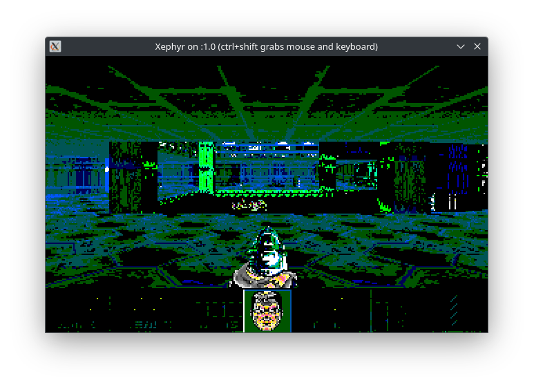

# DOOM

I had a bit of fun (and experienced some frustration) while trying to get the old DOOM code (released in 1997) from the [id-software repository](https://github.com/id-Software/DOOM) to run on my modern system. I managed to get it somewhat operational as a 32-bit executable on Linux, but I had to use Xephyr emulate a display that's suitable to run this version of DOOM. I experienced severe graphical anomalies:



Despite the weird graphics and lack of audio (see John Carmack's comments on that [here](README-id-software.txt#L12)), it's still functional. Maybe I'll investigate those things further someday.

# Building

Build DOOM with the following commands:

```
git clone https://github.com/Diordany/DOOM.git
cd DOOM/linuxdoom-1.10
mkdir linux
make
```

To clean the object files and binaries, run:

```
make clean
```

# Running

You can run DOOM with:

```
./linux/DOOM
```

In order to run this version of DOOM, your display has to support the 8-bit PseudoColor mode. Alternatively, if your display does not support this, it can be bypassed by connecting it to a nested X server like [Xephyr](https://wiki.archlinux.org/title/Xephyr).

## Running with Xephyr

First create the display with:

```
Xephyr -br -noreset -screen 320x200x8 :1 &
```

*Refer to the Xephyr documentation for more details. Leave out the `&` if you don't want to push the process to the background.*

Then attach DOOM to the display with:

```
./bin/DOOM -disp :1
```

## Setting the Resolution

The screen resolution can be set with the options:

| Option | Resolution |
|--------|------------|
| -2     | 640x400    |
| -3     | 960x600    |
| -4     | 1280x800   |

*Note that the `-4` option is [broken](linuxdoom-1.10/i_video.c#L478).*